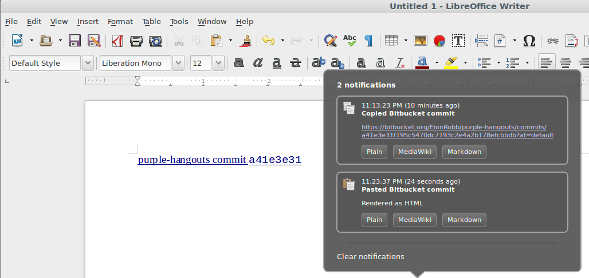

# Ecliptic

An intelligent clipboard tool for GTK-based desktops.

## What does it do?

Ecliptic watches for text being copied to the standard X Windows clipboard.

When it sees interesting URLs copied, it can automatically transform them so that you can paste them as:

* Rich text/HTML links (for example `http://slashdot.org` → `<a href="http://slashdot.org">Slashdot</a>`)
* Markdown links (e.g. `[title](http://the.url/stuff)`)
* MediWiki links (e.g. `[title http://the.url/stuff]`)

Currently it knows how to handle links to stuff I use frequently at work:

* Commits/branches/etc. on GitHub
* Commits and branches on Bitbucket
* Atlassian JIRA tasks
* Windows UNC-path shared drives

## Requirements

* Python 2.7
* Python `libnotify2`
* PyGtk 2.x

## TODO

Configurability, icons, more default handlers, more testing, etc. etc.

## Screenshot

Ecliptic on my Ubuntu [Cinnamon](https://en.wikipedia.org/wiki/Cinnamon_(software))
desktop, having captured a link to a commit on Bitbucket, and then pasted it
as rich text into LibreOffice Writer:

